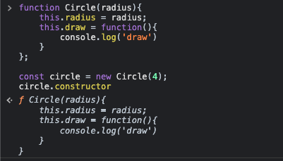
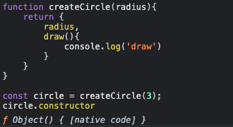

# Factory functions

```js
function createCircle(radius) {
  return {
    radius,
    draw() {
      console.log("draw");
    },
  };
}

const circle1 = createCircle(5);
```

# Constructor Function

```js
// uses camel case notation
function Circle(radius) {
  this.radius = radius;
  this.draw = function () {
    console.log("draw");
  };
}
const circle1 = new Circle(4); // what happens under the hood?
```

# Constructor property

> Every object in js has **Constructor** , it's the reference to fn that was used to create the object



---



_Object() is built-in constructor function that constructs the objects_

### There are several built-in constructor functions in JS:

> let obj = { }; === let x = new Object(); <- happens under the hood

- Number(). But we use number literal (5 , 6 , 3)
- String(). But we use string literal ('hello', 'world')
- Boolean(). But we use boolean literal (true, false)
- Function().

> All Functions are object's methods. Constructor function of functions is Function, with help of what we can create objects.
> All functions have methods: call , apply.

# Value types and Reference Types. (Primitives and objects)

## Value types:

1. Number
2. String
3. Boolean
4. Symbol
5. undefined
6. null

```js
let x = 5;
let y = x;

x = 10;

console.log(x); // 10
console.log(y); // 5
```

> **_Primitives are copied by their value._**

```js
let x = 10;

function increment(number) {
  number++;
}

increment(x);

console.log(x); // 10
```

In the example above, x has primitive value, when it is given as an argument to function , the value is copied , so original value didn't change.

## Reference types:

(all of them are objects)

1. Object
2. Function
3. Array

```js
let x = {
  value: 5,
};
let y = x;

x.value = 10;

console.log(x); // { value: 10 }
console.log(y); // { value: 10 }
```

> Basically , reference types are just references to address in the memory. When assigning y = x, we assign the address , which is the same.  
> **_Objects (reference types) are copied by their reference to address in memory_**

```js
let obj = { value: 10 };

function increment(obj) {
  obj.value++;
}

increment(obj);

console.log(obj.value); // 11
```

In the example above , object (reference type) was given as an argument , it is reference type , so when we change it in function , we change its value in location , so original value is also changed.

# Enumerating properties

```js
const obj = {
    a: 5,
    b: 10
};
for (const key of object) {
    console.log(key); // Error: Object is not iterable
}

// But we can do next:

for (const key of Object.keys(obj)) {  // Object.keys returns array of object's keys
    console.log(key);  // a , b
    console.log(obj[key]); // 5 , 10
}


// Object.entries

This is method of Object (constructor function), which returns an array with [key,pair] values

const arr = Object.entries({ name: 'Mike', age: 34 });

console.log(arr); // [ ['name' , 'Mike']  ,  ['age' , 34]  ]


// Check whether element exists in object

console.log( 'name' in { name: 'Mike' } ); // true


```

# Cloning object

> (all methods copy first level of object only)

1. **_for in_** loop

```js
let obj1 = {
  a: 1,
  b: 2,
  c: {
    d: 3,
  },
};

let obj2 = {};

for (key in obj1) {
  obj2[key] = obj1[key];
}

console.log(obj2); // { a: 1 , b: 2, c: { d: 3 }  }
```

2. **_Object.assign_**

```js
let obj1 = {
  a: 1,
  b: 2,
  c: {
    d: 3,
  },
};

let obj2 = Object.assign({}, obj1); // joins two objects

console.log(obj2); // { a: 1 , b: 2, c: { d: 3 }  }
```

3. **_Spread operator {...}_**

```js
let obj1 = {
  a: 1,
  b: 2,
  c: {
    d: 3,
  },
};

let obj2 = { ...obj1 };

console.log(obj2); // { a: 1 , b: 2, c: { d: 3 }  }
```

# Deep Clone (all levels)

```js
const obj3 = { a: 0, b: { c: 0 } };
const obj4 = JSON.parse(JSON.stringify(obj3));
```

# Garbage collection

In JavaScript , when you create an object, the memory is automatically allocated to this object. When we are done using it , the memory is automatically deallocated. JavaScript engine has so-called **Garbage Collector**. Its job is to find the variables and constants that are no longer used , and to deallocate the memory that was allocated for them earlier.

# String

```js
1. String primitives.
const message = 'hi'; // typeof string


2. String object.
const message = new String('hi'); // typeof object


When we put dot after a string primitive , JS Engine wraps it with String object, so we can work with it like it is an object with methods and properties.


-----------------------------------------------

Some string object methods:
1. message.includes(smth); // returns if a string has smth
2. message.index(smth); // returns the index smth start at
3. message.replace(a,b); // returns a string with replaced with b, does not change the original value.
4. message.trim(); // returns a string with removed spaces at the start and at the end of the string. Does not change its original value.

-----------------------------------------------

\ means 'ignore the next character';
Example: 'My name is Ma'ruf' // error
'My name is Ma\'ruf' // no error , ' is ignored

```

# Template Literal

```js
const name = "John";
const another = `This is 
my first string! ${John} `;
```

# Date Object

```js
const now = new Date();

// We can set different formats by passing arguments

const past = new Date('20/04/2018'); // short date; Fri Apr 20 2018 00:00:00 GMT+0500 (Узбекистан, стандартное время)
const past1 = new Date('April 20 2018' or '20 April 2018' ); // ling date. Fri Apr 20 2018 00:00:00 GMT+0500 (Узбекистан, стандартное время);
const past2 = new Date('2018-04-20'); // ISO Date. Fri Apr 20 2018 05:00:00 GMT+0500
and others...
```

> The ISO format follows a strict standard in JavaScript. The other formats are not so well defined and might be browser specific

All Date objects have methods of two types:

1. **Get** methods
   now.getFullYear(); // 2022
   now.toISOString(); // 2022-12-04T00:00:00.000Z
2. **Set** methods
   now.setFullYear(2018); // year is changed to 2018

# Function

Function types:

1. Function Declaration.

```js
function sayMessage(msg) {
  console.log(msg);
}
sayMessage("Hello"); // Hello
```

2. Function expression. Function creation is done after **=** operator. Also you don't give name to function itself.

```js
const sayMessage = function (msg) {
  console.log(msg);
}; // here we use ; bcs we assign the value to function || value
sayMessage("Hello"); // Hello
```

#### Function is a value (Функция - это значение) , which represent an action.

```js
// For both cases , this will apply:
alert(sayMessage); // there are no (), so function is not called;

//  function sayMessage(msg){
//      console.log(msg);
//  }
```

### Differences between function expression and function declaration.

1. Creation
   _Function declaration._ Created with 'function' in main flow (поток) of code
   _Function expression._ Created inside other expression after **_=_** operator.
2. How JS engine create them.
   _Function declaration._ Before working on script , JS engine searches for function declarations and create them (initialization stage), and then executes the rest of the code => **function declarations can be called before they are use created.**
   _Function expression._ Created after execution flow (поток выполнения) comes to = function ... . **Cannot be used before it is created.**
3. _Function Declaration_ is visible (can be accessed by others) only in the block of code where it is initialized.

```js
let age = prompt("Сколько Вам лет?", 18);

if (age < 18) {
  function welcome() {
    alert("Привет!");
  }
} else {
  function welcome() {
    alert("Здравствуйте!");
  }
}

welcome(); // Error: welcome is not defined
```

But we can access the function with _function expression_ , but with special syntax.

```js
let welcome;

let age = prompt("Сколько вам лет", 18);

if (age < 18) {
  welcome = function () {
    alert("Привет!");
  };
} else {
  welcome = function () {
    alert("Здравствуйте!");
  };
}

welcome(); // Welcome can be accessed
```

> Function Declaration is more noticeable in code that function expression

### Arrow functions

```js
let func = (arg1,arg2) {
  console.log(arg1+arg2);
}

// is the same with function expression

let func = function(arg1,arg2){
  console.log(arg1,arg2);
}

```

- if we have one argument, we can remove parentheses (). Ex:

```js
let func = (arg1) => console.log(arg1);
```

- Arrow Function can be used the same as function expression. When using arrow functions with > 1 instructions , you should use {} ,and also return statement should be used if you want to return something. By default , if you use 1 instruction without {} , the value is automatically returned.

## this

**_this_** is a keyword that can be used in object's methods , accessing an object itself. Arrow functions doesn't have its **own** 'this'. It inherits this keyword from its parent.

# Arrays

### Adding elements

1. To the end. **array.push(items);** returns the last element being added

```js
const numbers = [1, 2, 3];
numbers.push(4, 5, 6); // [1,2,3,4,5,6]
```

2. To the beginning. **array.unshift(items)** returns the length of final array.

```js
const numbers = [4, 5, 6];
numbers.unshift(1, 2, 3); // [1,2,3,4,5,6]
```

3. To any position. **array.splice(start,deleteCount, items)** returns array of deleted elements.

```js
const numbers = [1, 4];
numbers.splice(1, 0, 2, 3); // [1,2,3,4]
```

### Removing elements

1. **array.pop( )** . Removes the last element of an array , and returns it.

```js
const numbers = [1, 2, 3, 4];
const lastElement = numbers.pop();
console.log(numbers); // [1,2,3]
console.log(lastElement); // 4
```

2. **array.shift( )** . Removes the first element of an array , and returns it.

3. **array.splice( startIndex, deleteCount, items )** . Removes given number of elements from array at given position and returns an array of deleted elements.

```js
const array = [1, 2, 3];
const nums = array.splice(1, 2);
console.log(array); // [1]
console.log(nums); // [2,3]
```

### Finding Elements (primitives).

1. **array.indexOf( searchElement, [ fromIndex ] )**
   _=== equation_

```js
const numbers = [1, 2, 3, 4, 5, 1, 2];
numbers.indexOf(1); // 0
numbers.indexOf(10); // -1
numbers.indexOf("2"); // -1

numbers.lastIndexOf(1); // 5

numbers.indexOf(1, 1); // 5
```

2. **array.includes( searchElement , [ fromIndex ] )**

```js
const numbers = [1, 2, 3, 4, 5];
numbers.includes(3); // true
numbers.includes(10); // false
```

### Finding Elements (references).

1. **array.find(callback(arrayElement))**

```js
const array = [
  { id: 1, name: "HTML" },
  { id: 2, name: "CSS" },
  { id: 3, name: "JS" },
];

const course1 = array.find((object) => {
  return object.name === "JS";
});
console.log(course1); // {id: 3, name: 'JS'}
```

2. **Find Index(callback(arrayElement))**

- Work the same as find method , but returns an index.

### Combining and slicing.

1. array1.concat(array2). Connects 2 arrays and returns a new array

```js
const array1 = [1, 2, 3];
const array2 = [4, 5, 6];
const connectedArray = array1.concat(array2);
console.log(connectedArray); // [1,2,3,4,5,6];
```

### Joining arrays

1. **array.join( [separator] )**. Returns string. By default separator is **_,_** .

```js
const array = [1, 2, 3, 4, 5];
console.log(array.join("+")); // 1+2+3+4+5
```

2. **string.split( [ seperator ], [ limit ] )**. Returns array.By default seperator is ''.

```js
// ['Hello' , 'World', '!']
```

### Sorting arrays

**array.sort( [ compareFunction ] )**. By default , sorting comes from Unicode values. Array itself is sorted

```js
const array = [4, 2, 1, 6];
array.sort();
console.log(array); // [1, 2, 4, 6]

const array = [
  { id: 1, name: "CSS" },
  { id: 2, name: "HTML" },
];

array.sort((a, b) => {
  if (a.name > b.name) return 1;
  if (a.name < b.name) return -1;
  return 0;
});
```

### Testing the elements of array

1. **array.every( callback(currentElement, index, array) => { } )**.
   Checks if all elements of array satisfy the condition and returns boolean.

```js
const array = [4, 1, 4, 6, 3];
let allPositive = array.every((element, index, array) => {
  return element >= 0;
});
console.log(allPositive); // true
```

2. **array.some**. Same as array.every method , returns boolean , checks if at least one element satisfy the condition.

```js
const array = [4, 1, 2, 3, -1, 1, 4];
const atLeastOneNegative = array.some((element, index, array) => {
  return element < 0;
});
console.log(atLeastOneNegative); // true
```

### Filtering ar array.

**array.filter( callback( element, index, array ) => { })**.Returns an array of element which satisfy the condition in callback fn. Does not modify the original array

```js
const array = [2, -3, -10, 33, 12];
const biggerThanTwo = array.filter((element, index, array) => {
  return element > 2;
});
console.log(biggerThanTwo); // [33, 12]
```

### Mapping an Array

**array.map( callback( element, index, array )=> { });**. Returns an array of modified elements according to body of the fn. Does not change the original array.

```js
const numbers [1,2,3,4,5];
const items = numbers.map((element,index,array)=>{
  return {value: element, index}
})
console.log(items);
//    [
// 0 : {value: 1, index: 0}
// 1 : {value: 2, index: 1}
// 2 : {value: 3, index: 2}
// 3 : {value: 4, index: 3}
// 4 : {value: 5, index: 4}
//    ]
```

### Reducing an Array.

The reduce() method executes callback function on each element of the array, in order, passing in the return value from the calculation on the preceding element. The final result of running the reducer across all elements of the array is a single value, which can be any value.

```js
const array = [-3, -1, 4, 8, 12];

let sum = array.reduce((accumulator, currentValue) => {
  return accumulator + currentValue;
}, 0); // 0 is initial value of accumulator. Accumulator is returned as a final result.

console.log(sum); // 20
```

### Let VS Var

**Var** variable has function scope , whereas **let** variable has block scope.
**Var** variable is attached to window object, **let** variable is not attached to window object

### THIS keyword

**_this_** keyword refers to the object , where the function is being used.

```js
let video = {
  play(){
    console.log(this);
  }
}

video.play(); // video object , because play is method of video object => this refers to the video object. Same with constructor functions.

const playVideo = ()=>{
  console.log(width);
};
playVideo(); // window object. Because the window object is executing the playVideo object, so this refers to global window object.


--------------------


const video = {
  title: 'title',
  tags: ['a','b','c'],
  showTags(){
    this.tags.forEach(function(){ // **
        console.log(this.title); // *
    })
  }
}
// this keyword in * line refers to window object, because function in line ** is not video method. How to fix?

1. use this keyword as a second param for forEach method. Second argument is the object which can be referenced inside the function with this keyword.
const video = {
  title: 'title',
  tags: ['a','b','c'],
  showTags(){
    this.tags.forEach(function(){ // **
        console.log(this.title); // *
    },this)
  }
}


2. use ( let self = this ) inside showTags method. Not recommended to use.

const video = {
  title: 'title',
  tags: ['a','b','c'],
  showTags(){
    let self = this;
    this.tags.forEach(function(){ // **
        console.log(self.title); // *
    })
  }
}

3. function.bind method

const video = {
  title: "title",
  tags: ['a','b','c'],
  showTags(){
    this.tags.forEach(function(){
      console.log(this.title);
    }.bind(this))
  }
}

video.showTags(); // title


4. with arrow functions

const video = {
  title: "title",
  tags: ['a','b','c'],
  showTags(){
    this.tags.forEach((tag)=>{
      console.log(this.title);
    })
  }
}

video.showTags(); // title
// in arrow functions , this is inherited from its parent, so it refers to video object


```

### Changing this keyword.

```js
1. function.call(thisArg, ...). thisArg refers to object , which can be acessed in function. ... are arguments of the function.

function showTags(a,b){
  console.log(this); // { title: 'title' }
  console.log(a + b); // 3
}

showTags.call({title: 'title'}, 1 , 3)


2. function.apply(thisArg, [...]). Same with call method , but arguments should be in array.

3. function.bind(thisArg, ...). Same with call method, but it doesn't call a function , it returns a function with given params. If you call it , it will always work with this and params given.

function show(a,b){
  console.log(this);
  console.log(a + b);
}

const newFunc = show.bind({title:"title"}, 1 , 2 );

newFunc();
// {title: "title"}
// 3


4. arrow function
// it inherits this keyword from its parent

```
